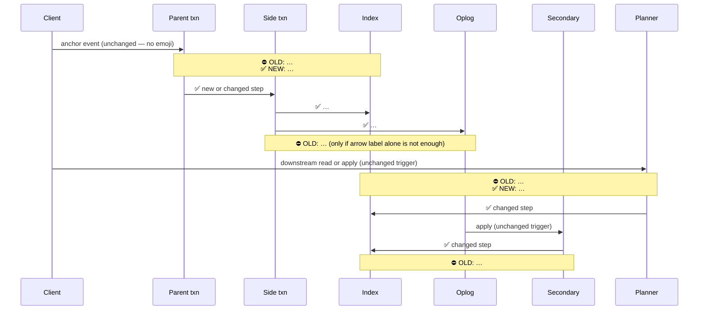
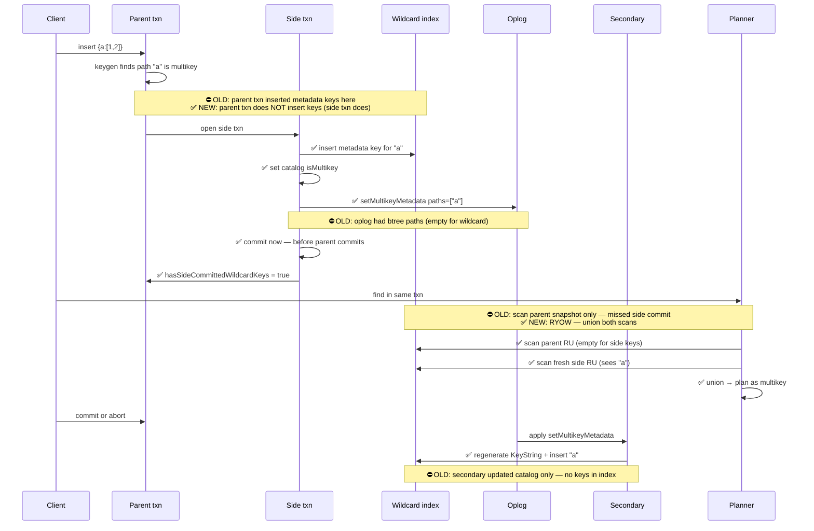
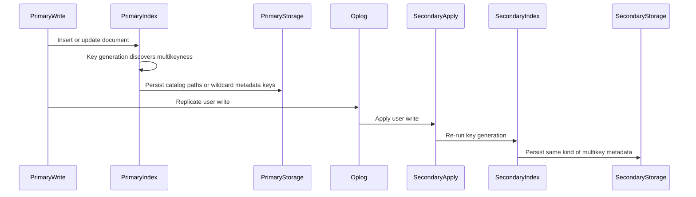
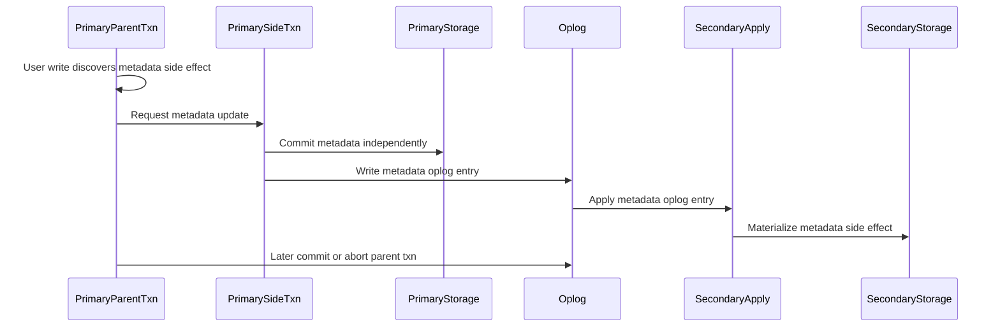
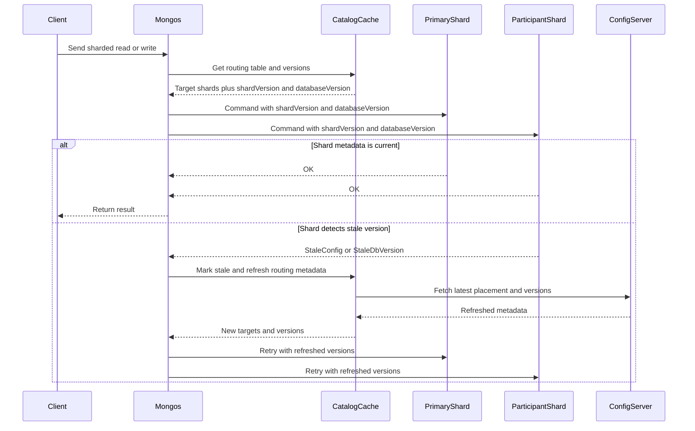
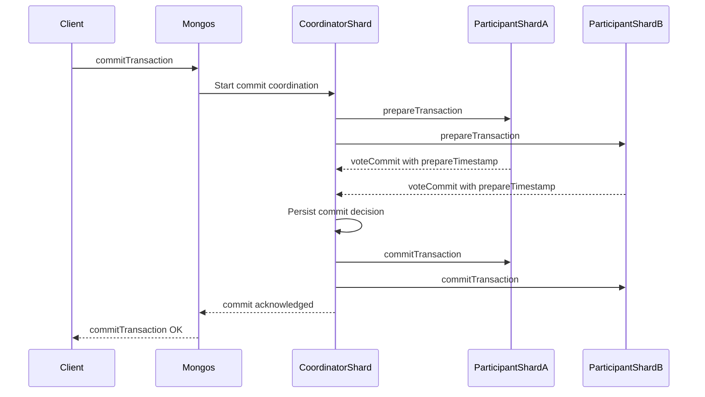
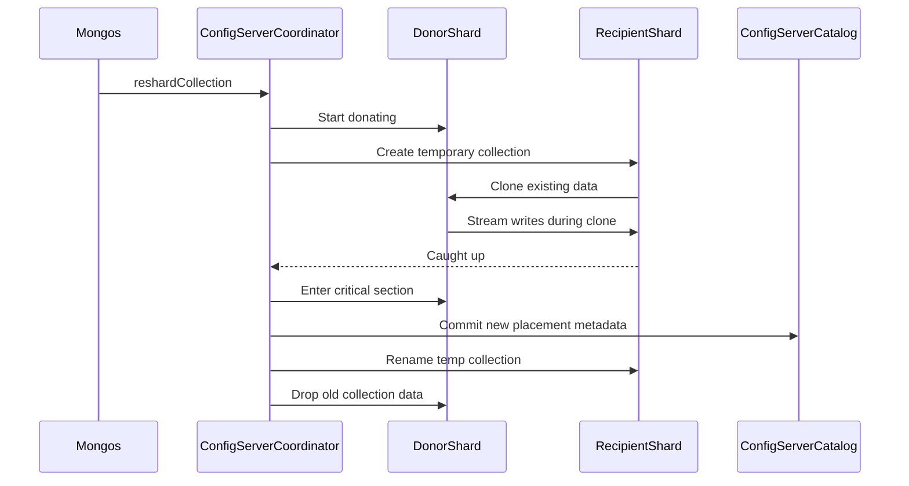

# Distributed Code Flow Diagrams

## Purpose

Use this skill to explain confusing code by extracting the right actors in the algorithm and drawing them in the distributed context where correctness matters. Do not draw only the local call stack when the bug or invariant crosses replication, sharding, transaction, timestamp, or metadata boundaries.

## Core Rule

Start with the distributed boundary, then add local components.

- Replication: include the primary node and relevant primary components, the oplog or replicated log entry, and the secondary node with relevant apply components.
- Sharding: include `Mongos`, the primary or target shard, participant shards, and `ConfigServer` when routing, placement, metadata, coordinator state, or refresh is part of the flow.
- Transactions: include the parent transaction, side transaction if present, prepare, commit, abort, and visibility boundaries.
- Local-only flows: include only the components that own state transitions or payload transformations.

## Algorithm

1. Identify one anchor event.
   Example: `wildcard index becomes multikey inside a transaction`.

2. Classify the scope:
   - local only
   - replication
   - sharding
   - transaction
   - mixed, such as sharded transaction or replicated transaction metadata

3. Create required actor lanes before adding local details.
   - Replication lanes: `PrimaryNode`, `PrimaryIndexCatalog`, `Oplog`, `SecondaryApply`, `SecondaryIndexCatalog`.
   - Sharding lanes: `Mongos`, `CatalogCache`, `PrimaryShard`, `ParticipantShardA`, `ParticipantShardB`, `ConfigServer`.
   - Transaction lanes: `ParentTxn`, `SideTxn`, `CoordinatorShard`, `ParticipantShard`.

4. Add local components only where they explain ownership.
   Avoid dumping every function. Prefer components that author state, transmit state, reconstruct state, validate state, or persist state.

5. Track payloads explicitly.
   Examples: `multikeyPaths`, `multikeyMetadataKeys`, `setMultikeyMetadata`, `opTime`, `commitTimestamp`, `shardVersion`, `databaseVersion`, `routing metadata`.

6. Mark phase boundaries.
   Examples: `before prepare`, `side txn commit`, `parent abort`, `secondary apply`, `participant decision`, `metadata refresh`, `critical section`.

7. After the diagram, add a short explanation answering:
   - who authors the state
   - how it is transmitted
   - who reconstructs or derives it
   - what must match across actors

8. If analyzing a **diff** (PR, branch, before/after): use **one lifecycle** with inline `⛔ OLD` / `✅ NEW` notes — see [Diff analysis](#diff-analysis-one-lifecycle-with-inline-beforeafter) below. Do not use `rect rgb`, `box`, or `classDef` for coloring.

## Mermaid Choices

- Use `sequenceDiagram` for lifecycles, transactions, replication, and sharding protocols.
- Use `flowchart TD` for decision trees or single-node algorithms.
- Prefer 4-8 participants. If more are needed, split into multiple diagrams.
- Use Mermaid-safe node IDs: no spaces, no reserved keywords, no styling.

### Renderer compatibility (Cursor, GitHub, many IDEs)

Do **not** rely on Mermaid color styling — it is often stripped or unsupported:

- `rect rgb(...)` / `rect #hex` — box outline may render; **fill color usually does not**
- `box green ...` — often **not visible** (needs Mermaid ~11+)
- `classDef fill:...` / `linkStyle stroke:...` — **often stripped**

Use **structure + emoji labels** instead of color. For full-color output, suggest [mermaid.live](https://mermaid.live) or an exported image.

## Diff analysis: one lifecycle with inline before/after

Use this when the user asks to explain a **diff**, **PR change**, **before vs after**, or when you are reviewing what a branch changed in a distributed flow.

### Rules

1. Draw **one** `sequenceDiagram` — the **after** lifecycle as the main arrow flow. Do not split into separate before/after charts unless the user asks.
2. At each **changed** step, add a `Note over` with both sides:
   - `⛔ OLD: …` — removed or broken behavior
   - `✅ NEW: …` — what replaces it
3. Prefix **new/changed message arrows** with `✅` in the label. Leave unchanged steps unmarked.
4. Keep the same participants and phase order as a plain lifecycle diagram — only annotate what the diff touches.
5. After the diagram, add a short read-this-as paragraph covering: who authors state now, what changed in transmission/reconstruction, and what invariants must still match.

### Template

### Example: diff lifecycle (wildcard multikey in txn)

Read this as: the diff moves metadata key authorship from the parent txn to an immediate side txn, changes the oplog payload format for wildcards, adds a dual-RU read path for RYOW, and makes secondaries reconstruct and insert keys instead of updating catalog alone.

## Example: Non-Transaction Multikey Replication

Read this as: primary and secondary both derive multikeyness from the same user write. The oplog carries the write, not a separate metadata event.

## Example: Transaction Side Metadata

Read this as: the side transaction is independent of the parent. If it commits, the secondary should apply the side-effect metadata event even if the parent later aborts.

## Example: Sharding Versioning Protocol

Read this as: `Mongos` owns targeting, `CatalogCache` owns the router's placement/version view, and shards validate `shardVersion` and `databaseVersion`. `StaleConfig` and `StaleDbVersion` are protocol signals to refresh and retry.

## Example: Distributed Transaction Commit

Read this as: once the coordinator persists the decision, recovery must drive every participant to that same decision.

## Example: Resharding Phase Machine

Read this as: resharding is a coordinator-owned phase machine. Donors own old data, recipients own clone/apply, and config metadata commit changes routing.
