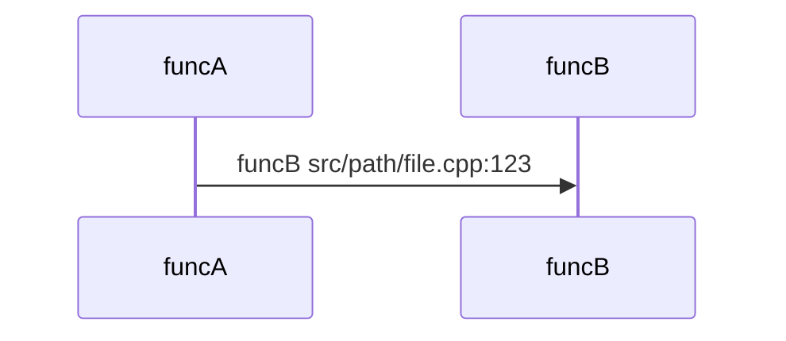

# Trace Function

## Required Behavior

Trace what happens when `<FUNC>` is called. Don't run anything — read the
source. Output:

1. A mermaid sequenceDiagram from `<FUNC>` down to its leaves. Every arrow
   labeled `funcName  file:line`. Use solid arrows for calls you verified
   in source, dashed (-.->) for any edge you had to guess.

2. A textual stack trace at max depth, top frame first:
   #0  funcName()     path/file.ext:LINE
   #1  caller()       path/file.ext:LINE

3. A "branches not taken" list: every if/switch/early-return that gates a
   different call path, with file:line.

Rules: cite file:line for every edge. If you can't verify a call from
source, omit it or mark it dashed. Don't suggest running, debugging, or
adding prints.

## Workflow

1. Treat this as a static source-reading task. Do not run tests, binaries, debuggers, servers, repros, or add logging.
2. Use the helper script only to find candidates. Never cite script output as proof.
3. Read the source for each included function, call edge, and branch gate.
4. Prefer omitting uncertain edges. Use dashed `-.->` only when an edge is necessary to explain the trace and clearly mark it as inferred.
5. Stop at leaves where no further project-local direct calls are verified, or where expanding would leave the requested scope.

## Helper Script

Run from the repository root:

```bash
python3 ~/.cursor/skills/trace-function/scripts/cpp_trace_links.py '<FUNC>' --root .
```

Useful options:

```bash
python3 ~/.cursor/skills/trace-function/scripts/cpp_trace_links.py '<FUNC>' --root . --max-depth 4 --json
python3 ~/.cursor/skills/trace-function/scripts/cpp_trace_links.py '<FUNC>' --root src/mongo/db --max-files 2000
```

The script reports candidate definitions, callers, callees, and nearby branch gates in C++ source files. It is regex-based and conservative by design; use it to decide what to read next, not as final evidence.

## Verification Rules

- Every final mermaid edge must cite the call-site source line.
- Every stack frame must cite the defining source line or the verified call-site line, whichever is clearer.
- Every branch not taken must cite the `if`, `switch`, `case`, `default`, ternary, or early-return line that gates an alternate path.
- For overloaded functions, templates, virtual dispatch, callbacks, function pointers, or macros, read enough surrounding code to distinguish candidate matches. If source cannot prove the edge, omit it or make it dashed.
- Keep paths relative to the repository root in final output.

## Output Template

````markdown


Textual stack trace:
#0  leafFunc()      src/path/file.cpp:456
#1  callerFunc()    src/path/file.cpp:123

Branches not taken:
- `condition description` gates `otherFunc()` at `src/path/file.cpp:120`
````
